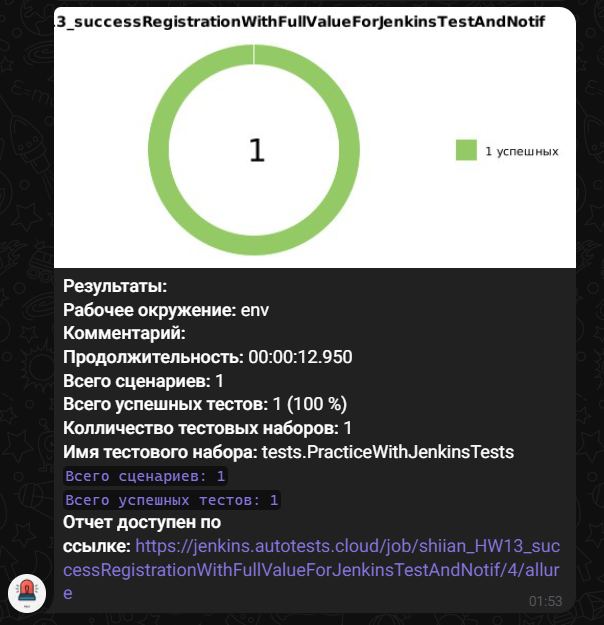

# Telegram-бот. Отправляем уведомления о результатах прохождении автотестов.

## Задание

1. Создайте проект с любыми автотестами, либо возьмите уже созданный.

2. Создайте задачу в Jenkins

3. Зарегистрируйте бота в Telegram, создайте чат и добавьте бота в него.

4. Добавьте бота к вашему проекту.

Ссылка на  job [Jenkins](https://jenkins.autotests.cloud/job/shiian_HW13_successRegistrationWithFullValueForJenkinsTestAndNotif/allure/)

